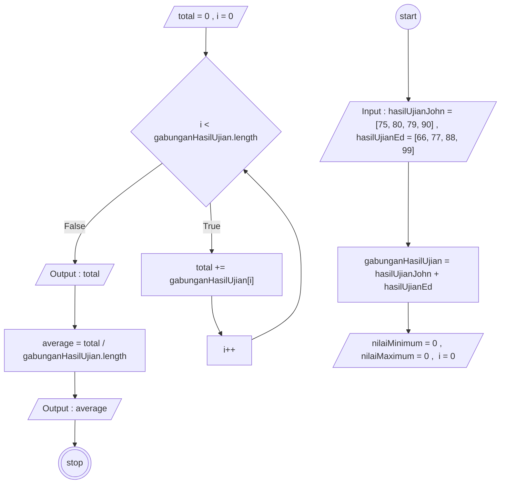

```mermaid
flowchart TD
  start@{shape: circle}
  input@{shape: lean-r, label : 'Input : hasilUjianJohn = [75, 80, 79, 90] , hasilUjianEd = [66, 77, 88, 99]'}
  gabung@{shape: rect, label : 'gabunganHasilUjian = hasilUjianJohn + hasilUjianEd'}

  total@{shape: lean-r, label : 'total = 0 , i = 0'}

average@{shape: rect, label : 'average = total / gabunganHasilUjian.length'}
  stop@{shape: dbl-circ}
ifGabungan@{shape: diamond, label : 'i < gabunganHasilUjian.length'}
totalYa@{shape: rect, label : 'total += gabunganHasilUjian[i]'}
iPlusPlus@{shape: rect, label : 'i++'}
OutputTotal@{shape: lean-r , label : 'Output : total'}
OutputAverage@{shape: lean-r , label : 'Output : average'}

minMax@{shape: lean-r, label : 'nilaiMinimum = 0 , nilaiMaximum = 0 ,  i = 0'}

  start --> input
  input --> gabung
  gabung --> minMax

total --> ifGabungan
ifGabungan --True--> totalYa
totalYa --> iPlusPlus
iPlusPlus --> ifGabungan
ifGabungan --False--> OutputTotal
OutputTotal --> average
 average --> OutputAverage --> stop


```
