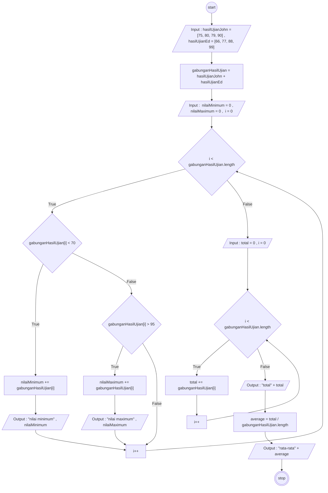

```mermaid
flowchart TD
  start@{shape: circle}
  input@{shape: lean-r, label : 'Input : hasilUjianJohn = [75, 80, 79, 90] , hasilUjianEd = [66, 77, 88, 99]'}
  gabung@{shape: rect, label : 'gabunganHasilUjian = hasilUjianJohn + hasilUjianEd'}

  minMax@{shape: lean-r, label :  'Input :  nilaiMinimum = 0 , nilaiMaximum = 0 ,  i = 0'}
  ifGabungan1@{shape: diamond, label : 'i < gabunganHasilUjian.length'}
  isMin@{shape: diamond , label : 'gabunganHasilUjian[i] < 70'}
  minMaxTrue@{shape : rect, label : 'nilaiMinimum += gabunganHasilUjian[i]'}
  outpuMin@{shape: lean-r, label : 'Output : "nilai minimum" , nilaiMinimum'}

  ifLebih95@{shape: diamond, label : 'gabunganHasilUjian[i] > 95'}
  ifLebih95True@{shape: rect, label : 'nilaiMaximum += gabunganHasilUjian[i]'}
  outpuMax@{shape: lean-r, label : 'Output : "nilai maximum" , nilaiMaximum'}

  plusplus@{shape: rect, label : 'i++'}

  total@{shape: lean-r, label : 'Input : total = 0 , i = 0'}
  ifGabungan@{shape: diamond, label : 'i < gabunganHasilUjian.length'}
  totalYa@{shape: rect, label : 'total += gabunganHasilUjian[i]'}
  iPlusPlus@{shape: rect, label : 'i++'}
  OutputTotal@{shape: lean-r , label : 'Output : "total" + total'}

  average@{shape: rect, label : 'average = total / gabunganHasilUjian.length'}
  OutputAverage@{shape: lean-r , label : 'Output : "rata-rata" + average'}

  stop@{shape: dbl-circ}

  start --> input
  input --> gabung
  gabung --> minMax
  minMax --> ifGabungan1
  ifGabungan1 --True--> isMin
  isMin --True--> minMaxTrue --> outpuMin --> plusplus
  isMin --False--> ifLebih95
  ifLebih95 --True--> ifLebih95True --> outpuMax --> plusplus
  ifLebih95 --False--> plusplus
  plusplus --> ifGabungan1
  ifGabungan1 --False--> total

  total --> ifGabungan
  ifGabungan --True--> totalYa
  totalYa --> iPlusPlus
  iPlusPlus --> ifGabungan
  ifGabungan --False--> OutputTotal
  OutputTotal --> average
  average --> OutputAverage --> stop
```
