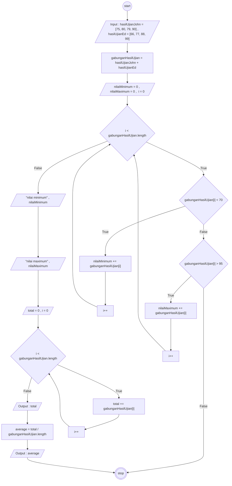

```mermaid
flowchart TD
  start@{shape: circle}
  input@{shape: lean-r, label : 'Input : hasilUjianJohn = [75, 80, 79, 90] , hasilUjianEd = [66, 77, 88, 99]'}
  gabung@{shape: rect, label : 'gabunganHasilUjian = hasilUjianJohn + hasilUjianEd'}

  total@{shape: lean-r, label : 'total = 0 , i = 0'}

average@{shape: rect, label : 'average = total / gabunganHasilUjian.length'}
  stop@{shape: dbl-circ}

ifGabungan@{shape: diamond, label : 'i < gabunganHasilUjian.length'}
totalYa@{shape: rect, label : 'total += gabunganHasilUjian[i]'}
iPlusPlus@{shape: rect, label : 'i++'}
OutputTotal@{shape: lean-r , label : 'Output : total'}
OutputAverage@{shape: lean-r , label : 'Output : average'}

minMax@{shape: lean-r, label : 'nilaiMinimum = 0 , nilaiMaximum = 0 ,  i = 0'}
minMaxTrue@{shape : rect, label : 'nilaiMinimum += gabunganHasilUjian[i]'}

ifGabungan1@{shape: diamond, label : 'i < gabunganHasilUjian.length'}
isMin@{shape: diamond , label : 'gabunganHasilUjian[i] < 70'}

outpuMin@{shape: lean-r, label : '"nilai minimum" , nilaiMinimum'}
outpuMax@{shape: lean-r, label : '"nilai maximum" , nilaiMaximum'}
plusplus@{shape: rect, label : 'i++'}

ifLebih95@{shape: diamond, label : 'gabunganHasilUjian[i] > 95'}
ifLebih95True@{shape: rect, label : 'nilaiMaximum += gabunganHasilUjian[i]'}
plusplus2@{shape: rect, label : 'i++'}

  start --> input
  input --> gabung
  gabung --> minMax
  minMax-->ifGabungan1
  ifGabungan1 --True--> isMin --True--> minMaxTrue
  minMaxTrue --> plusplus --> ifGabungan1
   ifGabungan1 --False -->outpuMin --> outpuMax

  isMin --False--> ifLebih95
  ifLebih95 --True--> ifLebih95True --> plusplus2
  plusplus2 --> ifGabungan1
  ifLebih95 --False--> stop

   outpuMax -->  total


total --> ifGabungan
ifGabungan --True--> totalYa
totalYa --> iPlusPlus
iPlusPlus --> ifGabungan
ifGabungan --False--> OutputTotal
OutputTotal --> average
 average --> OutputAverage --> stop


```
